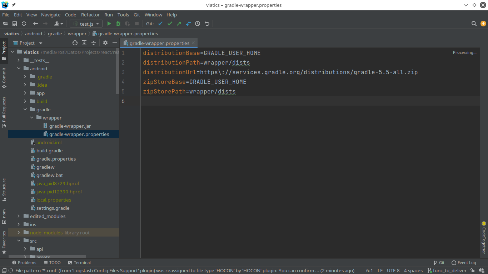
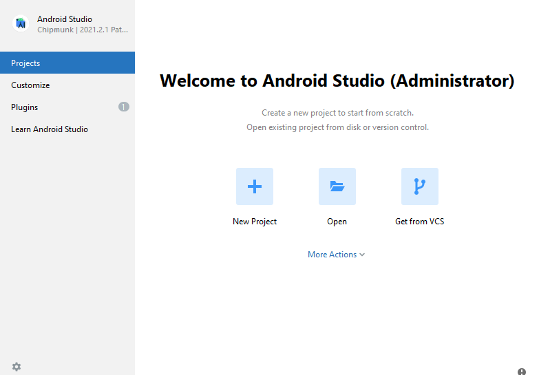

# Sheet para instalar React Native en Windows

https://reactnative.dev/docs/environment-setup

## Dependencias
 - Node
 - JDK
 - Android Studio

###  Para los que usan Chocolatey

choco install -y nodejs-lts openjdk11

### Sin chocolatey 

### Instalacion de node
https://nodejs.org/dist/v18.12.1/node-v18.12.1-x64.msi

### Instalacion de Java

[Java SE Development Kit (JDK)](https://openjdk.java.net/projects/jdk/11/)

    Se recomienda para utilizar con react native tener la versión 11 instalada

https://download.java.net/java/GA/jdk11/9/GPL/openjdk-11.0.2_windows-x64_bin.zip

#### Version mas reciente
https://download.oracle.com/java/19/latest/jdk-19_windows-x64_bin.msi

    En caso de instalar la versión mas reciente hay que actualizar el gradle, en el archivo  {project root folder}\android\gradle\wrapper\gradle-wrapper.properties 

Últimas versiones de gradle
https://gradle.org/releases/

### Instalación de Android Studio

#### 1. Descargar e instalar android studio
https://developer.android.com/studio/index.html 

#### 2. En el wizard asegurarse de que lo siguiente está marcado
Android SDK
Android SDK Platform
Android Virtual Device

    Consejo: Instalar el sdk en D y no en C

#### 3. Instalar Android SDK
Android 12 (S) SDK  (requerido)

##### 1. Click en  More Actions o  Appearance & Behavior → System Settings → Android SDK.

##### 2. Marcar Android 12 (S) SDK y marcar en Show Package Details

En los detalles marcar:

- Android SDK Platform 31
- Intel x86 Atom_64 System Image or Google APIs Intel x86 Atom System Image

##### 3. Mirar en Android SDK Build-Tools y marcar la 31.0.0, esta es la api mínima requerida para publicar en PlayStore

##### 4. Configurar la variable ANDROID_HOME
    1. Abrir panel de administración 
    2. Cuentas de usuario -> Cuentas de usuario
    3. Cambiar variables de entorno
    4. Crear nueva variable (ANDROID_HOME) que apunte al lugar donde está el Android SDK

        Para ver donde está instalado el sdk
        Appearance & Behavior → System Settings → Android SDK.

    5. Para verificar si fue agregada la variable 
        1. Abrir powershell
        2. Copiar y pegar Get-ChildItem -Path Env:\ into powershell
        3. Verifcar que ANDROID_HOME fue añadida

##### 5. Agregar platform-tools al path

    1. Abrir panel de administración .
    2. Cuentas de usuario -> Cuentas de usuario
    3. Cambiar mis variables de entorno
    4. Seleccionar la variable Path
    5. Editar
    6. Agregar path de los platform-tools

    Carpeta por defecto
    %LOCALAPPDATA%\Android\Sdk\platform-tools

    Antes de correr el proyecto configurar el modo desarrollador del teléfono y habilitar el debugging sobre USB
    Correr adb devices